# SmartCity Twin: Simulator Kecerdasan Lalu Lintas Terdistribusi

[](https://www.python.org/)
[](https://www.riverbankcomputing.com/software/pyqt/)
[](LICENSE)

Proyek simulasi *digital twin* desktop berbasis Python yang dirancang untuk mendemonstrasikan konsep **Komputasi Paralel**, **Sistem Terdistribusi**, dan **Arsitektur Multi-MCU**. Proyek ini ditujukan sebagai Evaluasi tiga mata kuliah **Komputasi Paralel (KOMPAR)**.

Seluruh sistem berjalan sebagai simulasi perangkat lunak mandiri tanpa perangkat keras fisik. Proyek ini menerapkan konsep **tanpa memori bersama (shared-nothing)**, di mana empat persimpangan jalan beroperasi sebagai unit mikrokontroler (MCU) virtual independen yang berjalan pada proses OS terpisah dan berkomunikasi melalui antrean pesan (*message-passing queues*).

---

## 📖 Daftar Isi
1. [Fitur Utama](#-fitur-utama)
2. [Konsep Komputasi Paralel & Terdistribusi](#-konsep-komputasi-paralel--terdistribusi)
3. [Arsitektur Sistem](#-arsitektur-sistem)
4. [Struktur Direktori File](#-struktur-direktori-file)
5. [Instalasi & Menjalankan Aplikasi](#-instalasi--menjalankan-aplikasi)
6. [Pengujian & Verifikasi](#-pengujian--verifikasi)
7. [Model Matematika Kinerja Paralel](#-model-matematika-kinerja-paralel)
8. [Panduan Uji Coba & Kontrol Interaktif](#-panduan-uji-coba--kontrol-interaktif)

---

## 🌟 Fitur Utama

* **Antarmuka Digital Twin**: Visualisasi interaktif real-time dari 4 persimpangan (Junction A-D) lengkap dengan indikator kepadatan lalu lintas, fase lampu lalu lintas yang dinamis, serta animasi pergerakan kendaraan.
* **Konkurensi Tingkat Proses**: Menghindari batasan *Global Interpreter Lock* (GIL) Python dengan menjadwalkan 4 proses MCU virtual pada inti CPU (*CPU core*) fisik yang berbeda secara paralel.
* **Model Memori Terisolasi**: Menerapkan arsitektur sistem terdistribusi murni tanpa variabel global bersama. Sinkronisasi data antar-proses sepenuhnya dilakukan melalui antrean pesan.
* **Kendali Sinyal Adaptif**: Setiap proses MCU virtual menjalankan algoritma waktu lampu hijau adaptif secara mandiri berdasarkan volume kendaraan lokal dan prediksi lalu lintas dari persimpangan tetangga.
* **Dasbor Diagnostik Kinerja**: Menampilkan metrik penggunaan prosesor, rata-rata latensi pesan, total throughput lalu lintas pesan, serta metrik komputasi *Speedup* dan *Core Efficiency*.
* **Injektor Kejadian Dinamis**: Kontrol interaktif untuk mensimulasikan kendaraan darurat (mengaktifkan sirine dan prioritas lampu hijau), lonjakan volume lalu lintas (*traffic surge*), dan kemacetan lokal (*congestion*).

---

## ⚡ Konsep Komputasi Paralel & Terdistribusi

Aplikasi ini mendemonstrasikan beberapa konsep akademis utama dalam komputasi paralel dan sistem terdistribusi:

### 1. Paralelisme Tugas (Task Parallelism)
Sistem membagi beban kerja berdasarkan **tugas** (*task*), bukan data (*data*). Setiap proses persimpangan menjalankan tugas logika kontrol lampu lalu lintas, pembaruan waktu siklus, dan komunikasi tetangga pada inti pemrosesan terpisah.

### 2. Komunikasi Terdistribusi (Shared-Nothing Architecture)
Setiap node MCU tidak memiliki akses ke alamat memori proses lainnya. Komunikasi dilakukan menggunakan 16 antrean pesan `multiprocessing.Queue` yang memodelkan jalur bus serial fisik (seperti UART/CAN-bus). Data diserialisasi menjadi format JSON sebelum dikirim dan dideserialisasi oleh penerima.

### 3. Emulasi Multi-MCU (Superloop Pattern)
Setiap proses persimpangan menerapkan pola eksekusi *Superloop* yang umum pada sistem tertanam (*embedded systems*):
* Menjalankan loop utama pada frekuensi 5Hz (`time.sleep(0.2)`).
* Membaca input dari sensor virtual (sensor deteksi kendaraan & sirine darurat).
* Menghitung perubahan *state machine* lokal (siklus lampu lalu lintas).
* Mengubah output aktuator virtual (fase lampu lalu lintas) dan mengirimkan data telemetri ke pusat.

### 4. Migrasi Agen Terdistribusi (Distributed Agent Migration)
Kendaraan di dalam simulasi tidak dikelola secara terpusat oleh memori global. Ketika sebuah kendaraan mencapai batas akhir jalan di suatu persimpangan:
* Proses persimpangan asal akan menserialisasikan status kendaraan tersebut.
* Status kendaraan dikirimkan ke persimpangan tujuan melalui pesan `VEHICLE_TRANSFER` lewat antrean IPC.
* Proses persimpangan tujuan mendeserialisasi pesan tersebut, mengambil alih kendali, dan melanjutkan simulasi perjalanan kendaraan tersebut di areanya.
Ini memodelkan bagaimana agen/objek bermigrasi secara dinamis di antara simpul pemrosesan terdistribusi yang mandiri.

---

## 🏗️ Arsitektur Sistem

Proses utama menangani antarmuka pengguna (GUI) dan agregasi statistik dari pusat data, sementara proses anak (*child processes*) bertugas menyimulasikan perhitungan lalu lintas lokal di masing-masing persimpangan.

```mermaid
graph TD
    subgraph Main Process [Proses Utama OS: GUI & Pengontrol Pusat]
        GUI[Dasbor GUI PyQt6]
        CC[Central Controller]
        GUI <--> |Panggilan Langsung / QTimer Polling| CC
    end

    subgraph Node Processes [Proses Anak: MCU Virtual]
        JA[Proses Junction A]
        JB[Proses Junction B]
        JC[Proses Junction C]
        JD[Proses Junction D]
    end

    %% IPC Controller ke Node
    CC <--> |multiprocessing.Queue| JA
    CC <--> |multiprocessing.Queue| JB
    CC <--> |multiprocessing.Queue| JC
    CC <--> |multiprocessing.Queue| JD

    %% IPC Node ke Node
    JA <--> |multiprocessing.Queue| JB
    JA <--> |multiprocessing.Queue| JC
    JB <--> |multiprocessing.Queue| JD
    JC <--> |multiprocessing.Queue| JD

    style Main Process fill:#1a1a2e,stroke:#3b3b5c,stroke-width:2px;
    style Node Processes fill:#112211,stroke:#2e5c2e,stroke-width:2px;
```



---

## 📂 Struktur Direktori File

```
├── analytics/                   # Modul Analisis Kinerja
│   ├── __init__.py
│   ├── efficiency.py            # Kalkulator efisiensi prosesor paralel
│   ├── speedup.py               # Pencatat waktu serial vs paralel
│   └── throughput.py            # Pelacak throughput pesan & kendaraan
├── communication/               # Protokol Komunikasi & IPC
│   ├── __init__.py
│   ├── messaging.py             # Dataclass pesan & serialisasi JSON
│   ├── protocols.py             # Spesifikasi protokol komunikasi
│   └── queues.py                # Pengelola IPC multiprocessing.Queue
├── controller/                  # Pengontrol Pusat & Telemetri
│   ├── __init__.py
│   └── central_controller.py    # Pengelola siklus hidup proses & agregator data
├── docs/                        # Dokumentasi Sistem
│   ├── architecture.md          # Penjelasan model arsitektur proses
│   ├── distributed_system.md    # Detail komunikasi terdistribusi & IPC
│   ├── multi_mcu.md             # Konsep multi-MCU & logika adaptif
│   ├── parallel_computing.md    # Teori komputasi paralel & speedup
│   └── testing.md               # Prosedur pengujian fungsional
├── gui/                         # Komponen Tampilan Antarmuka PyQt6
│   ├── __init__.py
│   ├── analytics_panel.py       # Tampilan metrik & statistik kinerja
│   ├── city_map.py              # Visualisasi peta digital twin interaktif
│   ├── log_panel.py             # Konsol log sistem terfilter
│   ├── main_window.py           # Jendela utama & tombol aksi kontrol
│   ├── monitoring_panel.py      # Panel status kartu masing-masing node
│   └── network_panel.py         # Visualisasi topologi jaringan & aliran pesan
├── nodes/                       # Proses Pekerja MCU Virtual
│   ├── __init__.py
│   ├── base_junction.py         # Logika superloop dasar MCU persimpangan
│   ├── junction_a.py            # Node A (Tetangga: B, C)
│   ├── junction_b.py            # Node B (Tetangga: A, D)
│   ├── junction_c.py            # Node C (Tetangga: A, D)
│   └── junction_d.py            # Node D (Tetangga: B, C)
├── simulation/                  # Fisika & Aturan Simulasi Lalu Lintas
│   ├── __init__.py
│   ├── emergency_events.py      # Pengendalian rute darurat
│   ├── traffic_generator.py     # Generator volume kendaraan acak
│   ├── traffic_logic.py         # Perhitungan kepadatan & lampu lalu lintas
│   └── vehicle.py               # Dataclass entitas kendaraan
├── tests/                       # Pengujian Kode (Unit Testing)
│   ├── run_tests.py             # Runner pengujian pustaka standar (stdlib)
│   ├── test_messaging.py        # Pengujian serialisasi pesan
│   └── test_traffic_logic.py    # Pengujian perhitungan lalu lintas adaptif
├── main.py                      # File utama untuk menjalankan aplikasi
├── requirements.txt             # Daftar pustaka dependensi (pip)
└── README.md                    # Panduan utama proyek (File ini)
```

---

## 🚀 Instalasi & Menjalankan Aplikasi

### Kebutuhan Sistem
- Python versi 3.9 ke atas yang telah terpasang di sistem operasi.
- Akses terminal (PowerShell di Windows, Terminal di macOS/Linux).

### 1. Pasang Dependensi
Buka direktori proyek melalui terminal, kemudian pasang pustaka eksternal yang dibutuhkan:
```bash
pip install -r requirements.txt
```

### 2. Jalankan Aplikasi
Jalankan skrip utama menggunakan interpreter Python:
```bash
python main.py
```
*(Catatan Windows: Aplikasi menggunakan `multiprocessing.freeze_support()` untuk menjamin pembuatan proses anak berjalan aman pada sistem operasi Windows).*

---

## 🧪 Pengujian & Verifikasi

Proyek ini dilengkapi dengan skrip pengujian untuk memvalidasi algoritma kepadatan, perhitungan durasi lampu hijau adaptif, serta serialisasi paket data.

### Opsi A: Pengujian Tanpa Pustaka Tambahan (Rekomendasi)
Gunakan runner bawaan yang memanfaatkan pustaka standar bawaan Python:
```bash
python tests/run_tests.py
```

### Opsi B: Menggunakan Pytest
Jika sistem Anda memiliki paket `pytest` yang terpasang:
```bash
pytest tests/ -v
```

---

## 📊 Model Matematika Kinerja Paralel

Metrik efisiensi pemrosesan paralel dihitung secara dinamis menggunakan rumus-rumus berikut:

### 1. Speedup ($S$)
Mengukur seberapa jauh peningkatan kecepatan komputasi paralel dibandingkan dengan eksekusi serial biasa:
$$S = \frac{T_{serial}}{T_{paralel}}$$
* Di mana $T_{paralel}$ adalah waktu nyata (*wall-clock time*) yang diukur dari simulasi.
* $T_{serial}$ dihitung secara teoritis sebagai $T_{paralel} \times N$ (dengan $N = 4$ sebagai jumlah core), yang mensimulasikan waktu jika satu prosesor tunggal menjalankan tugas 4 persimpangan secara bergantian.

### 2. Efisiensi Core ($E$)
Mengukur tingkat efektivitas pemanfaatan core prosesor yang dialokasikan:
$$E = \frac{S}{N}$$
* Nilai efisiensi $1.0$ ($100\%$) menunjukkan peningkatan kecepatan linear yang sempurna. Di dunia nyata, nilai ini akan sedikit lebih rendah karena adanya overhead penjadwalan OS dan serialisasi data pada IPC.

---

## 🎛️ Panduan Uji Coba & Kontrol Interaktif

Untuk mendemonstrasikan sistem kontrol terdistribusi yang adaptif kepada dosen penguji atau audiens presentasi, gunakan kontrol berikut pada dasbor:

1. **▶ Start**: Mengaktifkan seluruh proses MCU virtual. Konsol log akan menampilkan Process ID (PID) unik untuk setiap proses anak.
2. **⚠️ Congest**: Pilih persimpangan target, lalu klik **Congest**. Jumlah kendaraan persimpangan tersebut akan melonjak seketika, indikator map akan berubah menjadi merah menyala, dan lampu peringatan pada monitoring card akan menyala.
3. **🚨 Emergency**: Klik tombol ini untuk memicu kendaraan darurat. Ambulans/mobil polisi akan muncul pada visualisasi. Sensor virtual MCU persimpangan akan membaca frekuensi darurat, langsung memutus siklus lampu lalu lintas reguler, dan memaksa lampu berubah menjadi **HIJAU** guna memberikan prioritas jalan.
4. **📈 Surge**: Menghasilkan arus lalu lintas besar yang melintasi jalanan. Anda dapat mengamati bagaimana node MCU saling berkomunikasi, bertukar pesan prediksi lalu lintas, dan memperpanjang fase lampu hijau secara adaptif sebelum kendaraan tiba.
5. **⏸ Pause / 🔄 Reset**: Menghentikan sementara simulasi proses atau menghentikan (*shutdown*) semua proses persimpangan dan mereset metrik kinerja ke keadaan awal.
